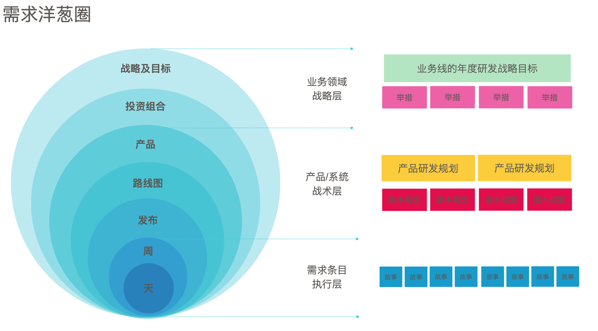
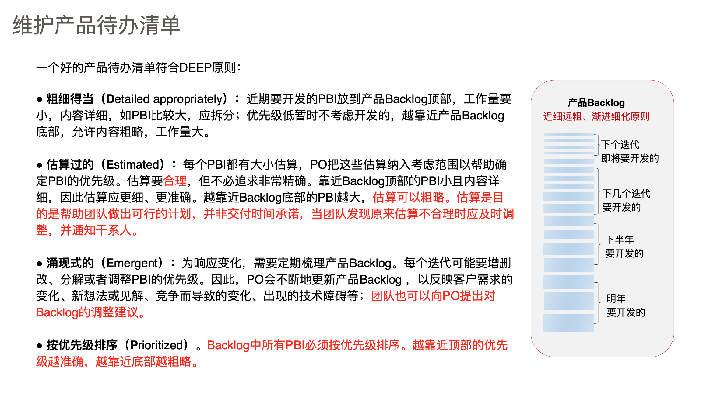
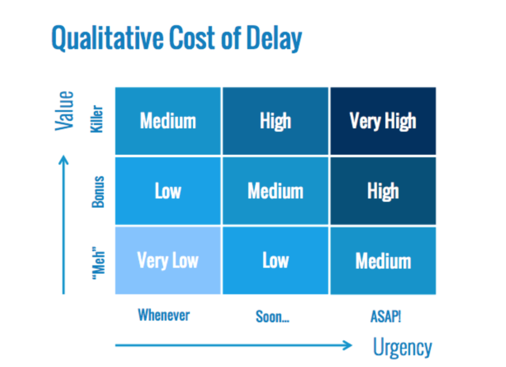
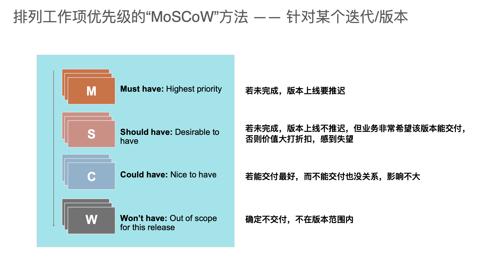
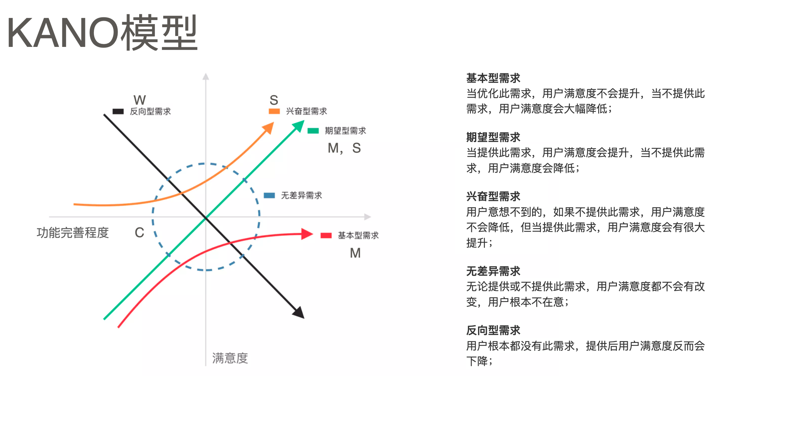

# 精益需求管理

- [精益需求管理](#%E7%B2%BE%E7%9B%8A%E9%9C%80%E6%B1%82%E7%AE%A1%E7%90%86)
  * [高响应力需求具备的条件](#%E9%AB%98%E5%93%8D%E5%BA%94%E5%8A%9B%E9%9C%80%E6%B1%82%E5%85%B7%E5%A4%87%E7%9A%84%E6%9D%A1%E4%BB%B6)
  * [需求洋葱圈](#%E9%9C%80%E6%B1%82%E6%B4%8B%E8%91%B1%E5%9C%88)
  * [MVP(Minimum Viable Product 最⼩小可⾏行行产品)](#mvpminimum-viable-product-%E6%9C%80%E2%BC%A9%E5%B0%8F%E5%8F%AF%E2%BE%8F%E8%A1%8C%E8%A1%8C%E4%BA%A7%E5%93%81)
    + [定义](#%E5%AE%9A%E4%B9%89)
    + [目的](#%E7%9B%AE%E7%9A%84)
  * [MMF (Minimum Marketable Feature)](#mmf-minimum-marketable-feature)
    + [定义](#%E5%AE%9A%E4%B9%89-1)
    + [目的](#%E7%9B%AE%E7%9A%84-1)
  * [MVP diff MMF](#mvp-diff-mmf)
  * [如何写高质量的用户故事](#%E5%A6%82%E4%BD%95%E5%86%99%E9%AB%98%E8%B4%A8%E9%87%8F%E7%9A%84%E7%94%A8%E6%88%B7%E6%95%85%E4%BA%8B)
  * [如何维护backlog](#%E5%A6%82%E4%BD%95%E7%BB%B4%E6%8A%A4backlog)
  * [story优先级排序方式](#story%E4%BC%98%E5%85%88%E7%BA%A7%E6%8E%92%E5%BA%8F%E6%96%B9%E5%BC%8F)
    + [方式一](#%E6%96%B9%E5%BC%8F%E4%B8%80)
    + [方式二](#%E6%96%B9%E5%BC%8F%E4%BA%8C)
    + [方式三](#%E6%96%B9%E5%BC%8F%E4%B8%89)
    + [方式四](#%E6%96%B9%E5%BC%8F%E5%9B%9B)

## 小记

* 用户往往不知道自己想要什么
* 用的说的 ！= 用户实际做的 ！=用户心里想的
* 产品化思维不是项目化思维
* 敏捷是概念，scrum是实际执行框架
* 人口陷阱
* 组件化必然导致瀑布开发模式
* 小批量、小批次的需求管理则带来市场需求响应速度的提升及需求传递准确性的提高

## 高响应力需求具备的条件

* 对业务领域、市场、⽤用 户需要有洞洞⻅见
* 以业务成效来度量量和验 证价值，形成价值闭环
* 真正以客户/⽤用户为中⼼心
* ⾼高度透明、可视化、协同 地、⾼高质量量地需求沟通
* 产品的需求，少就是多 (Less is More), 做减法;
* 跨职能的产品团队

## 需求洋葱圈

## MVP(Minimum Viable Product 最小可⾏产品)

### 定义

通过做实验的⽅方式来验证新产品的潜在价值/增⻓长假设。 针对产品具有最⼤大⻛风险的假设，⽤用尽可能低的成
本设计⼀一个最⼩小可⾏行行“产品”，通过快速投放到市场 上获取反馈，验证是否可⾏行行。

### 目的

验证假设

## MMF (Minimum Marketable Feature)

### 定义

MMF是针对产品⽬目标市场，为实现某个业务⽬目标提供
的最⾼高优先级的最⼩小需求集

### 目的

把产品做⼩小使其能尽早投⼊入市场，以最⼤大化商业价值。

## MVP diff MMF

| 名称 | MVP | MMF |
| --- | --- | --- |
| 不同点 | 目的是验证假设（找方向）  | 尽早投⼊入市场，以最⼤大化商业价值 “朝对的方向小步快跑，持续迭代!" |
|  |   可以是开发程序，发布⼀一段视频/⼴广告， 或者⼈人⼯工完成测试  | 开发需求池中具有最⾼高优先级的最⼩小需求集 |
| 共同点    | MVP 思想： Start small，尽早让“产品”接触⽤用户，从反馈中学习； “产品”可体验，适度考虑⽤用户体验； | |

## 如何写高质量的用户故事

好的用户故事符合INVET原则，写用户故事考虑的顺序是：VTSINE。

## 如何维护backlog

## story优先级排序方式

### 方式一

   ^  价值大小
   ｜
   ｜
   ｜
   ｜
   ｜
   ｜
   ｜-很少--每月--每周--每天--每次--> 频繁程度
     
### 方式二

> 基于延迟成本模型的专题优先级排序
> 
> Cost of Delay 是硅⾕谷常⽤用来做投资决策分析的⽅方法，可以定量量也可以定性分析。

### 方式三

> 排列列⼯工作项优先级的“MoSCoW”⽅方法 —— 针对某个迭代/版本

### 方式四

> KANO 模型

