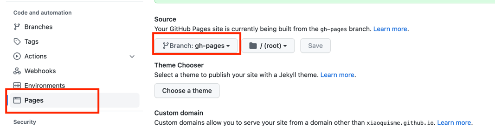

= auto generate

最近准备让博客在GitHub上页有一份备份，用的是GitHub page，然后发现了一个小问题就是GitHub page默认是readme，也就是readme是默认入口，你的其他文件都只能在readme中放链接。

导致一个问题：
> 每次写完博客之后要在readme中进行更新，否则readme就看不到

于是写了一个 link:https://github.com/1483523635/blogs/blob/master/generate.sh[自动化脚本]

> 扫描当前repo然后自动生成markdown类型的readme

脚本写好了。

## 怎么用呢

. git pre-push hook
. github action 自动调用脚本，然后将更新的readme文件commit到github上
走的是第二条路
自动化脚本有兴趣的同学可以去看一下link:https://github.com/1483523635/blogs/blob/master/generate.sh[generate.sh]
之后就是github Action
详细的action文件：link: https://github.com/1483523635/blogs/blob/master/.github/workflows/build.site.yml[build-site]
有两个action

[source, yaml]
----
    #  自动生成 readme 文件
    - name: GENERATE_README
      run: bash ./generate.sh

    # commit readme 文件
    - name: Commit changes
      uses: EndBug/add-and-commit@v4
      with:
        author_name: GITHUB_GENERATOR
        author_email: 1483523635@qq.com
        message: "AUTO GENERATE README"
        add: "*.md"
      env:
        GITHUB_TOKEN: ${{ secrets.GITHUB_TOKEN }}
----

一切都自动化了真好。

== 更新

昨晚和今天上午讲github page 从markdown 更新到 ascii doctor。

[quote]
.原因
----
后续写的blog都是用 adoc写的，然后现在默认的github page不支持 adoc的渲染。
----

=== 方法
更新github action。添加adoc的渲染工具，他会找到readme.adoc 渲染为 readme.html 之后， 将index.html文件指向readme.html.
[source,yaml]
----
    - name: asciidoctor-ghpages
      uses: manoelcampos/asciidoctor-ghpages-action@v2.2.1
      with:
        # asciidoctor_params: --attribute=nofooter
        pdf_build: true
        # adoc_file_ext: .ascii # default is .adoc
        # source_dir: docs/ # default is .
        # slides_build: true
        # pre_build:
        # post_build:
----

=== 问题
访问github-page **404**了

[quote]
.原因
----
github page 默认是用 master分支做的render， 然后 adoc把文件放到了gh-pages分支。然后就找不到了。
----

.解决方法

开了两年的issue终于可以关了。！！！！
