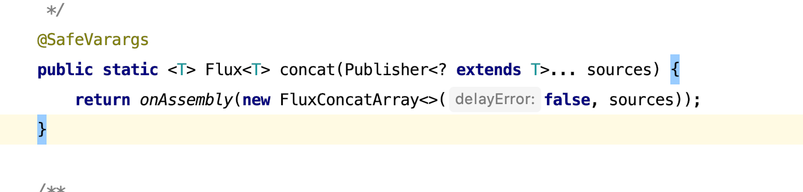

# 如何将两个数据流接到一起，然后进行操作

[Flux](https://github.com/reactor/reactor-core#flux)是Project Reactor中的概念。

## 一个需求
> 我有两个数据流的源头，想要把他们合并到一起 然后组合成一个新流去返回。

### 思路一
> 我将两个flux流转化为mono，在其中一个流中进行一个flatMap操作，然后将两个流连接到一起。
#### 看代码
```java
@Test
void name() {
    final Flux<Integer> oddSource = Flux.fromIterable(Arrays.asList(1, 3, 5, 7, 9));
    final Flux<Integer> evenSource = Flux.fromIterable(Arrays.asList(2, 4, 6, 8, 10));
    final List<Integer> totalList = oddSource.collectList()
        .flatMap(oddList -> evenSource.collectList().map(evenList -> {
            evenList.addAll(oddList);
            return evenList;
        })).block();
    assertThat(totalList)
        .containsExactly(2, 4, 6, 8, 10, 1, 3, 5, 7, 9)
        .size()
        .isEqualTo(10);

}
```

### 思路二
感觉这个是骚操作。并且我流中的数据顺序并不是我期望的那样：`第一个流中的数据，应该在前面`。
于是找到了另外一个操作符[concatWith](https://projectreactor.io/docs/core/release/api/reactor/core/publisher/Flux.html#concatWith-org.reactivestreams.Publisher-),并且保序是我需要的
#### 看代码
```java
@Test
void name1() {
    final Flux<Integer> oddSource = Flux.fromIterable(Arrays.asList(1, 3, 5, 7, 9));
    final Flux<Integer> evenSource = Flux.fromIterable(Arrays.asList(2, 4, 6, 8, 10));
    final List<Integer> totalList = oddSource.concatWith(evenSource)
        .collectList().block();

    assertThat(totalList)
        .containsExactly(1, 3, 5, 7, 9, 2, 4, 6, 8, 10)
        .size()
        .isEqualTo(10);

}
```
后边发现需求又变了：
> 我有四个流，然后要将这个四个流合并到一起，然后去返回。

#### 三种方法
* 将flux换成mono，然后多进行几次`flatMap`操作
* 多次调用flux的实例方法`concatWith`
* 调用flux的静态方法`concat`


方法一和方法二大致和前边两种写法一致,
##### 方法三
```java
@Test
void name2() {
    final Flux<Integer> oddSource = Flux.fromIterable(Arrays.asList(1, 3, 5, 7, 9));
    final Flux<Integer> evenSource = Flux.fromIterable(Arrays.asList(2, 4, 6, 8, 10));
    final List<Integer> totalList = Flux.concat(oddSource,evenSource)
        .collectList().block();

    assertThat(totalList)
        .containsExactly(1, 3, 5, 7, 9, 2, 4, 6, 8, 10)
        .size()
        .isEqualTo(10); 

}
```
`Flux.concat`方法接收的是比变长参数就不展示了，可以看下该方法的源码


该方法接受的是publisher类型的参数，所以Mono的source也可以接上来
#### 代码
```java
@Test
void test3() {
    final Flux<Integer> oddSource = Flux.fromIterable(Arrays.asList(1, 3, 5, 7, 9));
    final Flux<Integer> evenSource = Flux.fromIterable(Arrays.asList(2, 4, 6, 8, 10));
    final Mono<Integer> monoSource = Mono.just(11);
    final List<Integer> totalList = Flux.concat(oddSource,evenSource, monoSource)
        .collectList().block();

    assertThat(totalList)
        .containsExactly(1, 3, 5, 7, 9, 2, 4, 6, 8, 10,11)
        .size()
        .isEqualTo(11);

}
```

其实这种reactive stream 和java的stream有很多相似之处，java如何将两个stream连接到一起java 8提供了`Stream.concat()`一样的思想，java 8 的stream用的多了，一些流里操作符也就很容易对应到Reactive Stream 上了。