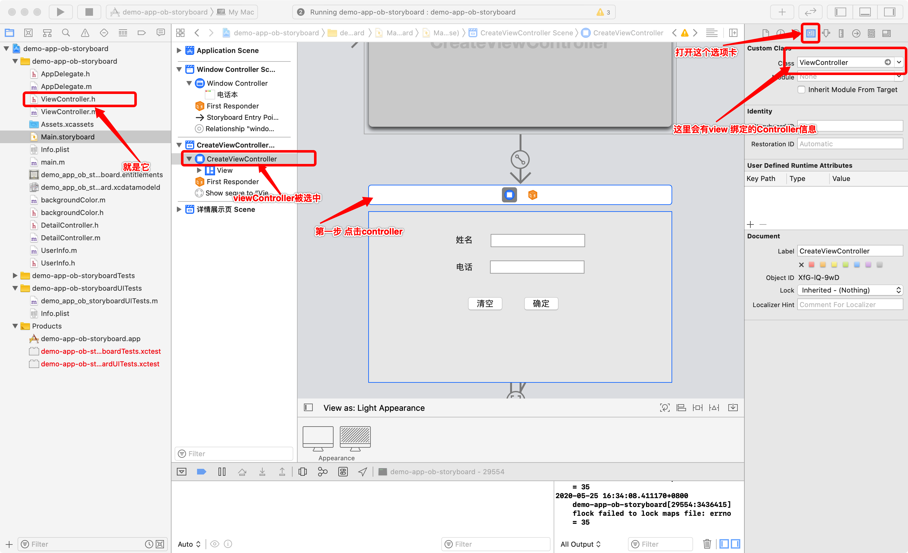
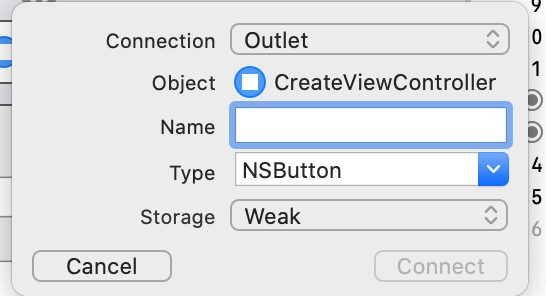
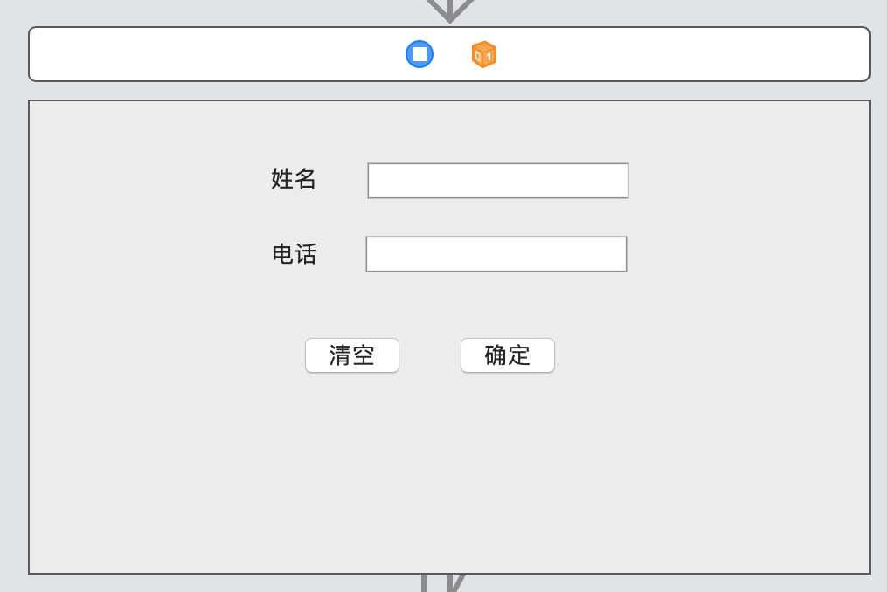
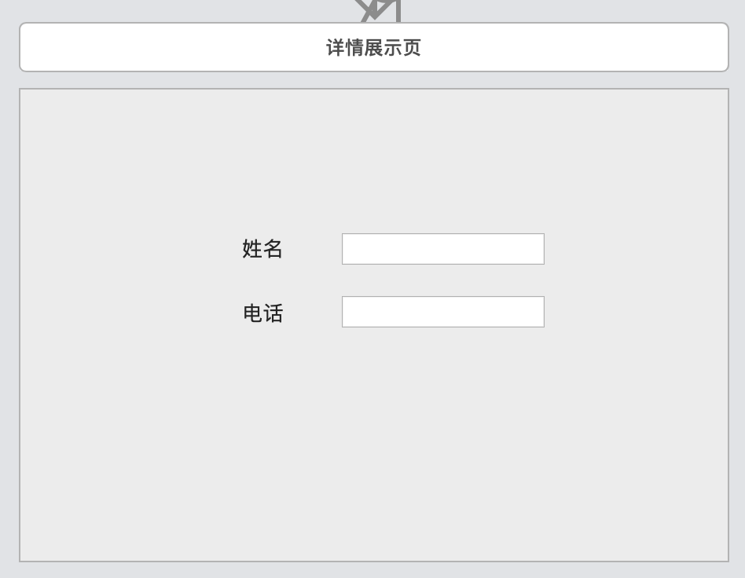
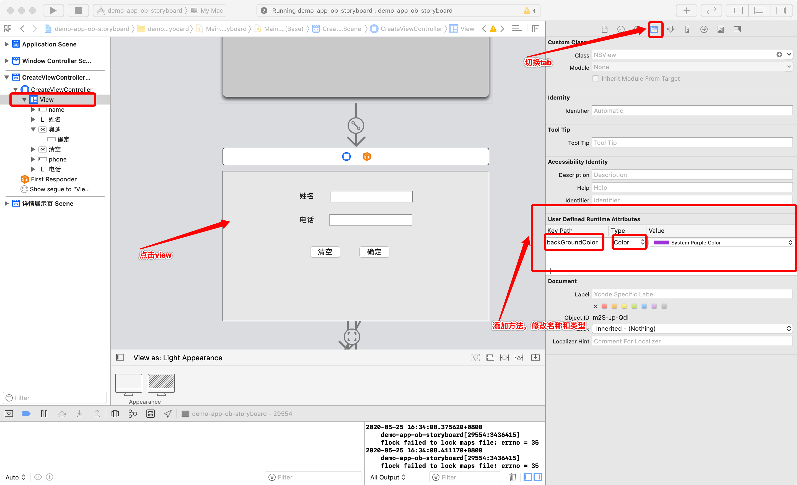
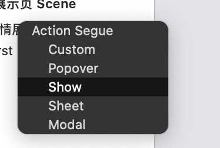
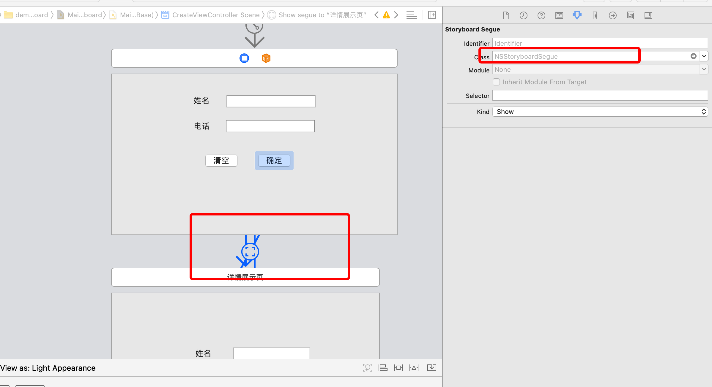

# Mac OS app 用 StoryBoard开发的一点感想。
## 前提
最近在学习app的逆向，准备自己搞一个app，然后用逆向工具对其进行恶搞一下。

## 选择
纠结在于用Mac app还是 IOS app，纠结了一下，选择了Mac app。
原因：
- 开发体验
    搞Mac app不用起模拟器。15年的阉割版的Mac跑起模拟器来那叫一个吵和卡。
- 开发效率
    电脑不卡，开发效率就会高一点，主要是心情会好，不然太卡的话，写代码的时候特别烦。
- 简单
    XCode打开，直接run就好了。
## 趟坑
- 以为的简单并不简单
    以为开发来说和和IOS的差不多，但是实际是关于Mac app的开发介绍的文章很少、[app 数量也很少](https://juejin.im/post/596d4cbe6fb9a06bc86e78c0)
- 在过去Objective-C一直是苹果生态里的重要语言，最近几年虽说主推Swift，但是应该也不至于死掉吧？
    没想到现在用Objective-C开发的实在是太少少了
- XCode 11
    嗯，你没看错，就是XCode11，这个版本的XCode UI应该是更新了，所以我能找到的文章都是Objective-C写的，那时候的XCode UI和现在的UI不一样
- StoryBoard
    负责UI层展示，这个有很多magic的操作，找不到那就JJ了，完全玩不动呀，当然苹果现在主推SwiftUI，所以。。。用的时候一直觉的微软是真的好呀，winform拖控件是真的简单。
    - 给按钮绑定个单击事件
        我搞了快一天，一直找不到storyboard的UI怎么和controller关联起来的，然后自然也找不到按钮的点击事件
        - 如何关联controller
        
        ```objective-c
        #import <Cocoa/Cocoa.h>
        @interface ViewController : NSViewController
        @end
        ```
        - 如何给按钮添加点击事件
          1. 在xcode中打开storyboard文件，找到你要添加点击事件的按钮。
          2. 在左侧文件列表中找到关联的那个controller，按住option键然后点击，出现双屏，一屏是storyboard，一屏是代码
          3. 按住control键，点着那个按钮拖向代码文件。
          4. 出现dialog，填上你的内容
            
          5. 结束
          简单的gif
          

## app的功能
  - 一个添加页面
    - 一个清除按钮,点击之后清除页面输入的数据
    - 一个确定按钮，点击之后会将信息携带到详情展示页面
    - 两个label，两个输入框
    - 设置view的背景色
    
  - 一个详情展示页面
    - 展示上个页面填写的内容
    
### 遇到问题
1. 代码里如何或者输入框里的内容
在ViewController.h中绑定两个属性，然后在impl中可以直接使用
做法：还是分屏，然后ctrl拖拽，之后就会生成两个属性
```objective-c
// interface
#import <Cocoa/Cocoa.h>

@interface ViewController : NSViewController
@property (weak) IBOutlet NSTextField *nameTextField;
@property (weak) IBOutlet NSTextField *phoneTextField;
@end

//impl
#import "ViewController.h"

@implementation ViewController

@synthesize nameTextField;
@synthesize phoneTextField;

// 获取姓名输入框的内容
- (NSString *)getName {
    return [nameTextField stringValue];
}
// 获取手机号输入框的内容
- (NSString *)getPhone {
    return [phoneTextField stringValue];
}
//清除输入框内容
- (IBAction)CancelClicked:(id)sender {
    [nameTextField setStringValue:@""];
    [phoneTextField setStringValue:@""];
}
// other code
@end

```
2. 如何设置背景色
拓展NSView，添加设置背景色方法，然后绑定到UI层，
    * 实现代码
```objective-c
// interface
#import <Foundation/Foundation.h>
#import <AppKit/AppKit.h>

@interface NSView (backGroundColor)
-(void) setBackGroundColor: (NSColor *) color;
@end

//impl
#import "backgroundColor.h"

@implementation NSView (backgroundColor)
- (void)setBackGroundColor:(NSColor *)color {
    [self setWantsLayer:YES];
    self.layer = [CALayer layer];
    [self.layer setBackgroundColor:[color CGColor]];
}
@end
```
  * 绑定
输入名称和拓展的方法一致，省掉set方法

3. 如何点击确定跳转到另一个界面呢
在storyboard界面找到按钮，ctrl拖到它点击之后要跳转的界面

之后出现这个dialog

这样就完成了。

4. 如何将值传过去呢
先看一下两个界面之间建立了啥

是个NSStoryboardSegue类型的东西
```objective-c
@interface NSStoryboardSegue : NSObject

/* NSStoryboardSegue instances have optional identifiers that can be assigned in Interface Builder. These identifiers can be used in overrides of -[NSViewController prepareForSegue:sender:] to differentiate segues. */
@property (nullable, readonly, copy) NSStoryboardSegueIdentifier identifier;

/* Subclasses of NSStoryboardSegue can use this property to access the source view or window controller that is being segued away from. */
@property (readonly, strong) id sourceController;

/* Subclasses of NSStoryboardSegue can use this property to access the destination view or window controller that's being segued to. This property is also essential for overrides of -[NSViewController prepareForSegue:sender:], which is passed to the source view controller. This property allows the receiver of -[NSViewController prepareForSegue:sender:] to access and pass configuration data to the destination controller. */
@property (readonly, strong) id destinationController;

@end
```
有sourceController和destinationController，是不是很明确了
   - 步骤
    1. 重写SourceController(`NSViewController`)的`- (void)prepareForSegue:(NSStoryboardSegue *)segue sender:(nullable id)sender`方法
    ```objective-c
      - (void)prepareForSegue:(NSStoryboardSegue *)segue sender:(nullable id)sender {
            DetailController *detailController = [[DetailController alloc] init]; // destinationController
            detailController = segue.destinationController;
            UserInfo *userInfo = [[UserInfo alloc] init];
            [userInfo setName:[self getName] andPhone:[self getPhone]];
            detailController.userInfo= userInfo;//设置要传递的值
        }  
    ```
    2. destinationController
    添加一个属性接收传递的值，在`viewDidLoad`方法里将传递的值给赋值到view上
    ```objective-c
    // interface
        @interface DetailController : NSViewController
        @property UserInfo *userInfo;
        @property (weak) IBOutlet NSTextField *nameTextField;
        @property (weak) IBOutlet NSTextField *phoneTextField;
        @end


    // impl
        @implementation DetailController
        @synthesize userInfo;
        @synthesize nameTextField;
        @synthesize phoneTextField;

        - (void)viewDidLoad {
            [super viewDidLoad];
            [nameTextField setStringValue:[userInfo name]];
            [phoneTextField setStringValue:[userInfo phone]];
        }
        @end
    ```

## 结束


## 遇到错误
> resource fork, Finder information, or similar detritus not allowed
Command CodeSign failed with a nonzero exit code

解决方法：进入项目的根目录执行` xattr -cr .`
    

## 引用
* [Mac Os DarkMode](https://stackoverflow.com/questions/51672124/how-can-dark-mode-be-detected-on-macos-10-14)
* [iOS - Code Sign Error in macOS High Sierra Xcode - resource fork, Finder information, or similar detritus not allowed - Stack Overflow](https://stackoverflow.com/questions/39652867/code-sign-error-in-macos-high-sierra-xcode-resource-fork-finder-information)

## 源码
https://github.com/1483523635/simple-MacOS-app
