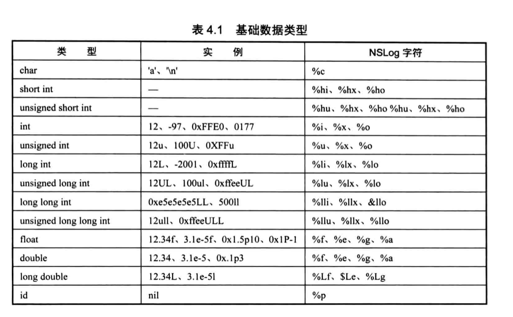
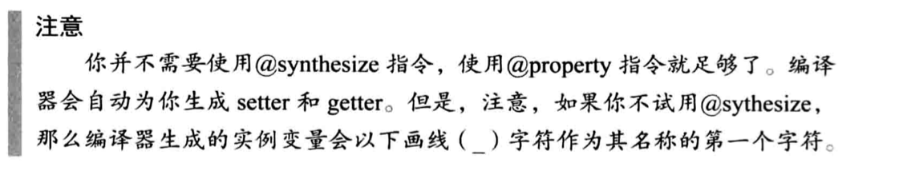
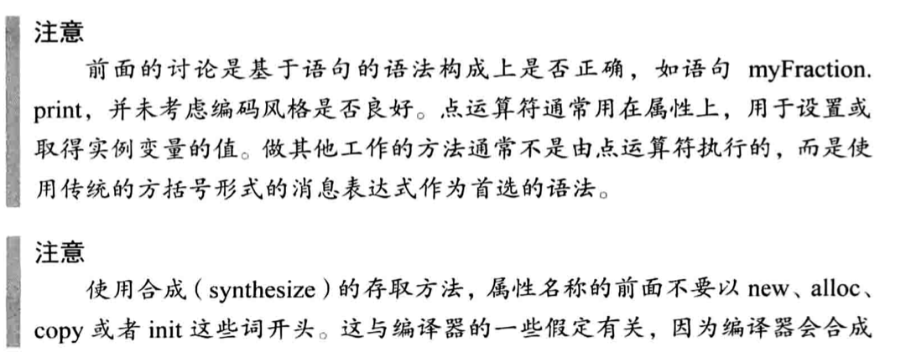
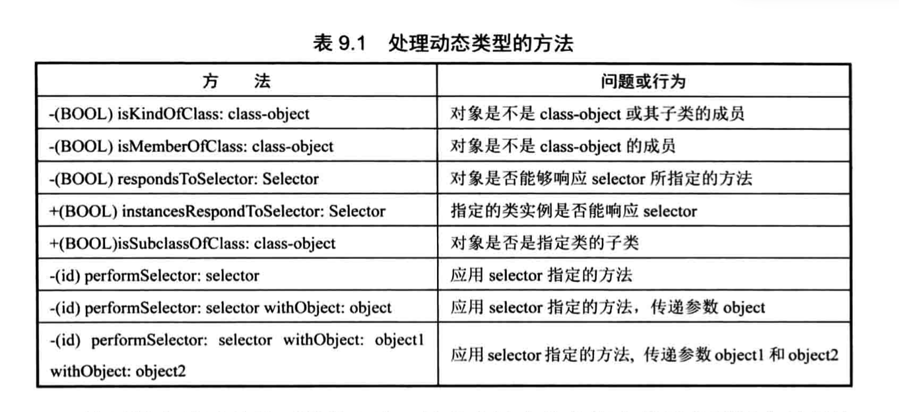
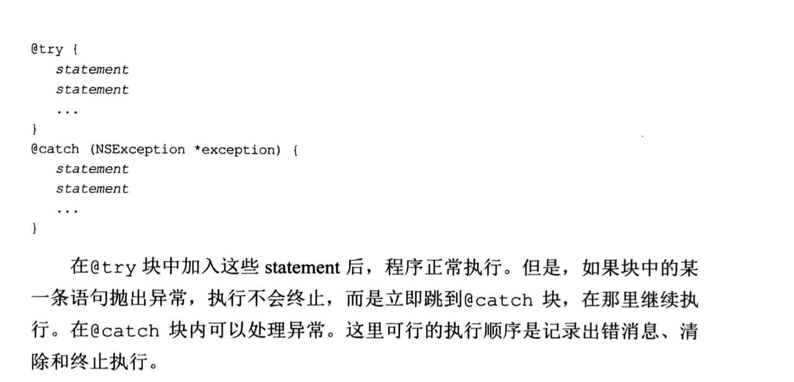
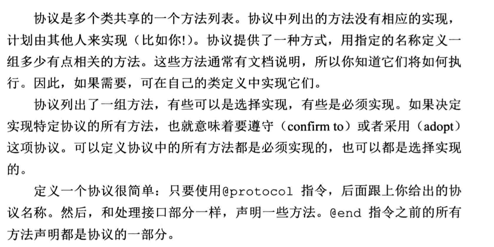

## Objective C 语法基础
## 方法调用
> [ClassOrInstrance method];
## + 和 -
> - 代表实例方法

> + 代表类方法
## 返回值
```
+(int) someMethod
```
## 参数
```
-(void) someMethod: (int) n;
```

## @implementation
```objective-c
@implementation NewClassName
{
    memberDeclarations;
}
    methodDefinitions;

@end
```

## 数据类型
* int
- float
- double
- char
- id
> 可以存储任何数据类型的对象


- Boolean (YES/NO)
> 该类型是由预处理程序的机制添加的

## import
- <> 代表是系统文件
- “something”代表自己创建的文件

## 类
### 初始化
```
方式一：
MyFunctions *myFunction = [MyFunctions alloc];
myFunction = [myFunction init];

方式二：
MyFunctions *myFunctions2 = [[MyFunctions alloc] init];

方式三：
MyFunctions *myFunctions3 = [MyFunctions new];
```

### 属性
#### getter 和setter自动生成
> 通过 @property注解来生成，实现接口方显式无需重写getter和setter方法


#### 使用方式
- [classInstanceName setA:1]
- classInstanceName.a=1

### 多个参数(高级语法)
定义：

`-(void) set:(int)from  to:(int)to;`
实现
```objective-c
-(void) set:(int)from to:(int)to{
    number1=from;
    number2=to;
}
```
使用
```objective-c
[classInstance from:1 to:2]
```

## 动态
### id 
有点类似于C#的dynamic，和var不是一个东西

### try-catch



## 分类
类似于C#的拓展方法
### 语法
```
@interface name (ExtendClassName)
{
    -(void) someMethod;
}
@end

#import 'name.h'
@implementation name (ExtendClassName)
{
    -(void) someMethod
    {
        //impl
    }
}
@end

```

## 协议

```objective-c
#import <Foundation/Foundation.h>

@protocol MyProtocol
@required
- (void)copy;
@optional
- (void) optionalCopy;
@end
```

