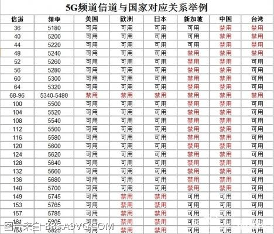
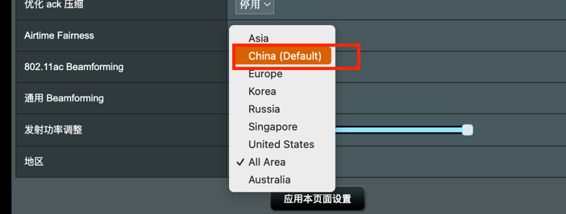
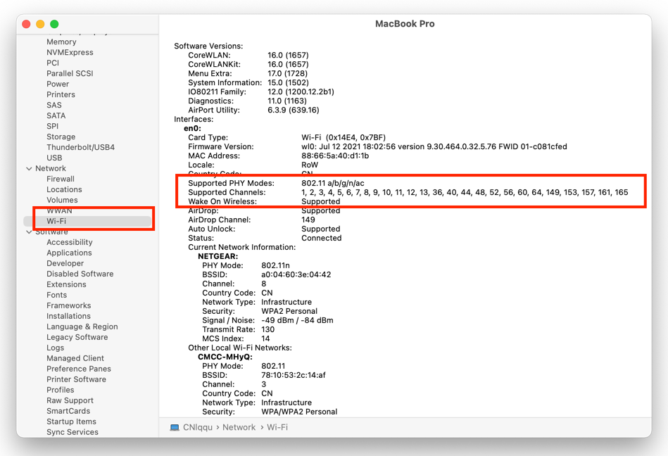
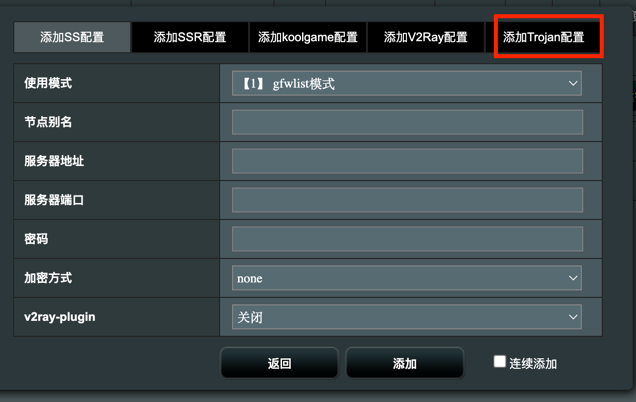
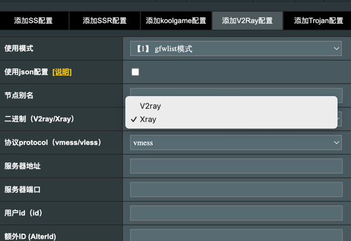

= 路由器频道折腾小记
:toc:
:icons: font
:url-quickref: https://docs.asciidoctor.org/asciidoc/latest/syntax-quick-reference/

今天折腾了一下路由器,原因是因为家里的日版switch找不到5G频道,并且2.4G频道网速还不好.
然后折腾好了之后, 发现MAC找不到5G频道了. 折腾的一圈记录

== 日版Switch 找不到5G频道
=== 原因:

. 日本的产品的频道和大陆定义的WI-FI频道不一样
. 路由器区域是大陆 默认频道是149

==== 具体差别如下：
wifi信道差别

路由器区域

默认频道（当时是149）

image::./images/img.png[默认频道（当时是149）, width=100%]

=== 修复方式：

修改路由器区域为所有区域。频道那里我没固定， 用的是自动。 然后自动选的就是100 然后Switch就能找到5G频道了。

== 国行Mac 找不到 5G频道
两台IPhone都能找到5G频道， 然后Mac压根没了这5G频道。

=== 原因：
因为国行的Mac支持的频道有限， 然后路由器默认是100的。

==== 具体支持频道

==== 修复方式
因为想让Switch和Mac都用5G频道， 只能调整频道了， 然后还要挑选一个Mac和Switch同时支持的频道。 那就**64**吧。

== 其他: 升级梅林的SS插件： 支持了xray，也支持 vmess+vless协议 + trojan
本来想找一找梅林的好用插件，结果网上全是科学上网的插件。 然后发现他支持Trojan. 果断升级。

Trojan

xray+ vless

=== 地址：
github.com/cary-sas/v2ray_bin
