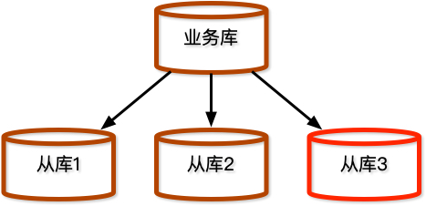
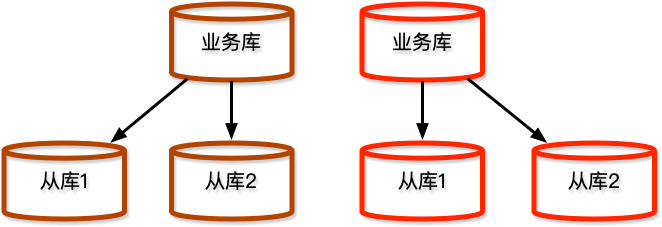

= 服务拆分方案和个人理解
:toc:

== 内容简介

主要聊一些微服务拆分的自己在项目上的实践总结，和个人对服务拆分和重构的理解。

== 背景

项目从17年启动，然后一直发展到现在。中间经历过服务拆分，服务合并，服务拆分😂, 是个曲折的故事。

目前在在做一个服务的拆分。

== 方案
[source, text]
====
. 数据库不变，新增从库
. 数据库新增用户
. 路由切换方案
. 从库变主库
. 删除无用的其他表
. 经过两个release（牵扯功能存在问题，和删除代码 的安全起见）
====

=== 新增从库
这一步是为了后续将从库直接变为主库，省掉了数据迁移的工作。

=== 数据库新增用户
在这个阶段新拆出来的服务还是用的原来的数据库，只不过新增了一个用户，这个用户只能访问新拆出来的这个服务依赖的表，然后原来老的服务的数据库用户，移除相关表的权限。

这样做有这么几个好处：

. 从逻辑上数据库已经拆分出去了， 但是物理上并没拆出去，一旦发现问题，可以快速切换。
. 可以帮助我们快速发现 *服务* 里手写sql *join* 移出去的表这种问题。

=== 路由切换方案

这里的切换方案当时选项有两种:
[source, text]
====
. 直接掏空旧服务，旧服务对外的API不发生任何变化，然后涉及到新服务业务表的操作，由原来的sql， 变成服务之间的调用，并通过feature toggle控制
. 一改到底，所有涉及新服务业务调用的地方，都直接改成调用新服务的接口，并且这些接口都通过feature toggle控制。

====

.方案一
|===
| 优点 | 缺点

| 改动范围小，前期工作量小，feature toggle容易控制
| 后期移除feature-toggle和删除代码等收尾工作风险高

|===

.方案二
|===
| 优点 | 缺点

| 后期删除代码，feature-toggle等收尾工作，风险小。
| 前期工作量大，需要梳理的上下文多。feature-toggle删除工作量也不小

|===

本着对生产的敬畏。 我们采用了第二种方案，因为风险最小。

只不过工作量看起来大了，如果只关注当前这一步，确实工作量大，如果站在整个服务拆分的方案上看，工作量其实没差。

==== feature toggle的小插曲

feature toggle的选择当时有两个选项

. 放在数据库里。通过API调用的方式判断是否打开
. 放在配置里，然后通过共享配置文件的技术方式，来控制。

最终我们采用 *方式二*（共享配置文件），大家觉得配置文件相比数据库，轻量级一些

由于设计feature toggle的时候直接考虑的是所有用户一起切换和撤回，没有考虑不同用户走不用API的方式。 后边出现了想让不同用户走不同API的需求的时候，由于开发已经进入尾声，改动范围大，成本高。 我们只能所有用户一起切换，一条道走到黑了。

如果采用 *方式一* 的话，这种需求改动就会很小。 当然站在当时的角度上看，还是 *方式二* 更合适。

=== 从库变主库

到这一步，新的服务已经能够稳定的运行了，开始考虑数据库的拆分了。

将新拉出来的 *从库3* 变为 *主库* ，删掉 *从库3* 里新服务没有用到的表。

然后基于 *新的主库* 拉出两个 *从库*

=== 收尾-删代码(重要)

删代码这个步骤不费劲，但是收益会很高，它会降低团队的认知负载，而且不容易出问题。

经历过其他团队做服务拆分，不删代码的痛苦，所以这个收尾我认为是十分必要的。

== 小结

到这里服务拆分已经结束了。

以下迁移代码过程中，我思考的一些东西：

个人将服务拆分分为三个层次：

. 无脑copy paste，代码的搬运工。
. 修复存在的问题如：
.. URL设计不合理
.. 接口实现设计不合理
.. 系统的各种考核指标不达标
.. 系统存在坏味道
. 修复业务逻辑不合理的地方，或者修复一些隐藏的业务逻辑方面的bug

第一层，基本的供应商应该都差不多。

第二层，稍微好一点的供应商也应该是OK的，如果重构，TDD等基本功扎实的话，也没啥问题。

第三层，这种对供应商要求比较高了， 需要在编写代码的过程中，梳理清除业务上上下文，并且逻辑能够闭环。

我在团队里一直跟同学们，强调我们是TW，我们要体现出我们和其他供应商不一样的地方。 一直按照第三层要求大家的。因为不想和其他供应商一样 平平淡淡。

=== 与重构的关系

.重构定义
[quote,Martin Fowler,《重构》]
____
所谓重构（refactoring） 是这样一个过程： 在不改变代码外在行为的前提下，对代码作出修改，以改进程序的内部结构。
____

服务拆分，它改变了代码的外部行为。 和明显打破了重构定义的前提。

那么是不是可以对服务拆分这么定义：

.服务拆分定义
[quote, ]
____
所谓 *服务拆分* 是这样一个过程： 在不改变 *产品* 外在行为的前提下，对 *系统* 作出修改， 以改进 *产品* 的内部结构
____

TIP: 粗体是和重构定义的差别

==== 十六字心法的体会和理解

《重构》第二版刚出的时候， 我立马下单了。当时正在重构一个有着 *10* 年生命的系统代码，被重构代码折磨的死去活来。拿到了健总的十六字心法，如获至宝，才将我的那次大规模重构顺利的完成。

那么服务拆分和《重构》第二版里 `译者序` 里提到的健总的十六字心法有没有关系呢？
我想应该是有的：

.十六字心法定义:
[quote, 王健]
____
旧的不变,

新的创建,

一键替换,

旧的再见。
____

.我所理解的关系
[source,text]
----
旧的不变,<1>

新的创建,<2>

一键替换,<3>

旧的再见。<4>
----
<1> 旧的服务对外暴露的接口不变
<2> 新的服务接口创建
<3> 旧服务的接口一键切为新服务的接口
<4> 旧的服务接口删除
