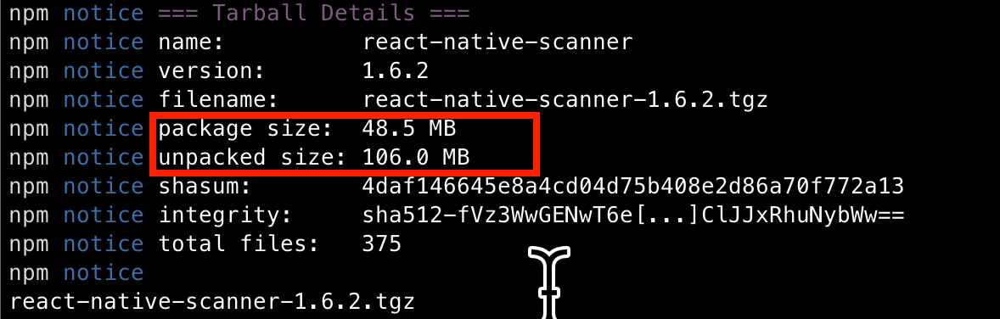
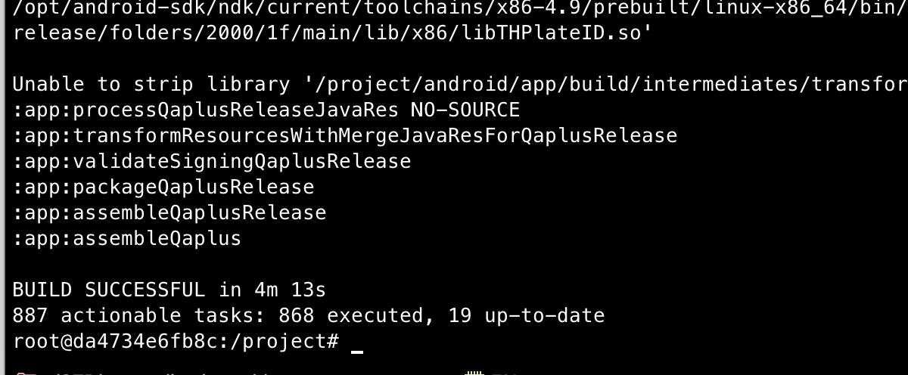
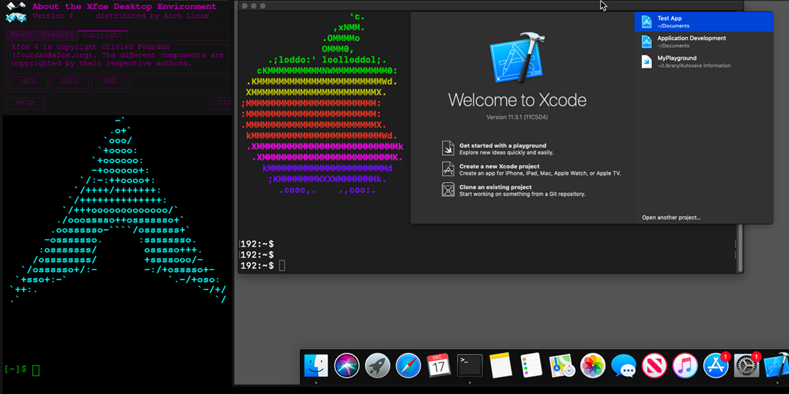

= 打包机容器化之路

== 背景

项目是基于RN的，要同时build ios和安卓两个版本的包，没有上架应用商店，目前是本地打包，然后上传到blob上，提供网页用于下载。

打包机是物理机， 最开始是两台13款的MBP 16 用于两个产品的打包， 后来产品线变成了一条，MBP变成了一个，由于在一条产品线上工作的人太多（最多到50人左右），一台打包机很明显的拖慢了团队的开发速度，于是找了一台Mac mini（为啥选mini后边说），两台打包机同时支持一条产品线。再后来ios 15来了，于是产品挂掉了，然后升级了Mac操作系统，由于MBP被MAC弃用了， 于是又来了一个mini。 然后两台mini支持着六七十人的团队开发。

这就是打包机近6年的发展史。

== 痛点
. 打包机掉线
. 一个打包机不够用,一次build大约30分钟，
. 由于代码仓库在德国，经常性获取依赖失败
. 不在客户现场，无法访问打包机定位问题
. 打包环境坏掉，导致出不了包

== 优化
=== 对于痛点1
总结了大概有这么三种原因：
[source,text]
----
. 被人合上了屏幕 // <1>
. go-agent 抽风了// <2>
. vpn断了 // <3>
----
<1> MBP合上了屏幕他就自动休眠了，于是打包机上都会贴上个 #*请不要合上屏幕*# 的sticker， 这也是为啥后边换mini的原因。
<2> *go-agent* 经常性的会跑着跑着然后就lost connect了，这个问题ops团队是专家，我还没研究过
<3> vpn 后边ops申请了一个用不掉线的vpn。 然后目前来看还是比较稳定的。

=== 对于痛点2
大概经历过这么几个过程：

1. 粗暴的加机器，嗯mini就是这么来的。
2. 深入调查

经过研究：发现代码仓库里有直接依赖source code的地方类似于：
[source, json]
----
{
  "dependencies": {
    "react-native-flip-card": "git+https://<token>@git.host.com/org/project-name.git#tag"
  }
}
----
由于我们的git的服务器在德国(每天晚上大约七点开始，基本就拉不下来代码了😂)。所以就很慢，然后直接依赖source code， 也没有压缩的过程。

==== 做法：打包 + 彻底私服化

把原来的source code 直接打成npm包，放到项目的npm私服上。

单单打个包 就省了一半多的size了，更不用说用自己的私服，带来网络速度的提升。妥妥的提升X倍以上呀。

既然都用私服了，那安装公网的npm依赖也用缓存的私服吧， 于是从淘宝切到到了私服。妥妥的速度提升呀。

还有android的gradle build过程，也切为缓存的私服吧， 也是妥妥的速度提升呀。

于是顺带着把痛点三也给解决了， 一举两得✌️

=== 对于痛点4

对于之前所有团队都在现场交付来说，可能不是痛点，因为白天上班看下就好了。

==== 第一阶段（疫情的特殊时期 ）

打包机抱回家（嗯 就是这样，不让来现场上班，打包机就带回家，宝贝一样的守护着😅）

==== 第二阶段（后疫情时代）

ssh的反向代理，通过端口映射可以做到和访问物理机一样效果（不受局域网的限制），

=== 对于痛点5

重启解决所有问题。

后边出现了重启不能解决的问题，比如java版本不对，以及打包环境莫名其妙的报错，于是趁着要下项目的空档，整了整虚拟化。

既然ios打包强依赖Mac系统，那就android虚拟化吧。

中间踩了一些坑， 比如

node 8.17.0 的npm命令在ubuntu上已经不支持了，

shell脚本Mac和Linux对同一个命令，语法格式不一样（之前都是在mac上跑所以一直没问题）

之前设置的环境变量都是写死的，只适用于Mac，到linux上也是一堆的错。

好在最终还是成功了。

== 下一步

1. ios好像也可以搞虚拟化，看到有个 https://github.com/sickcodes/Docker-OSX[docker镜像]，可以跑Mac, 后边可以继续尝试，将ios打包也迁移到docker里。

