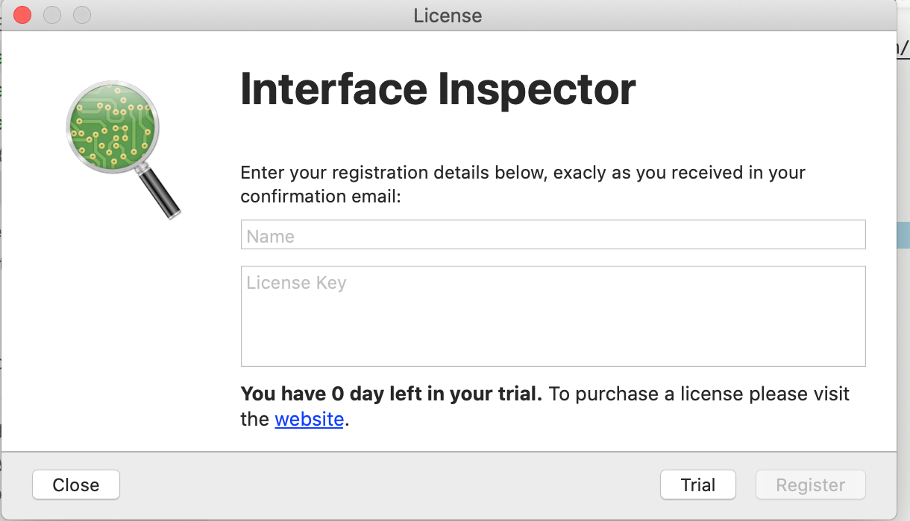
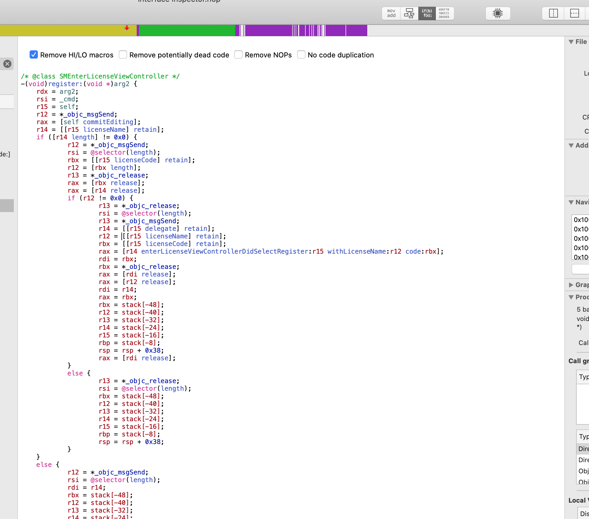
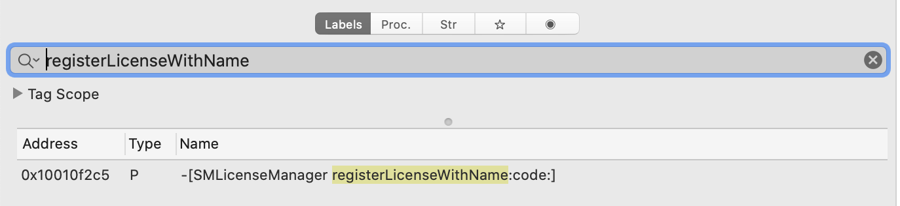
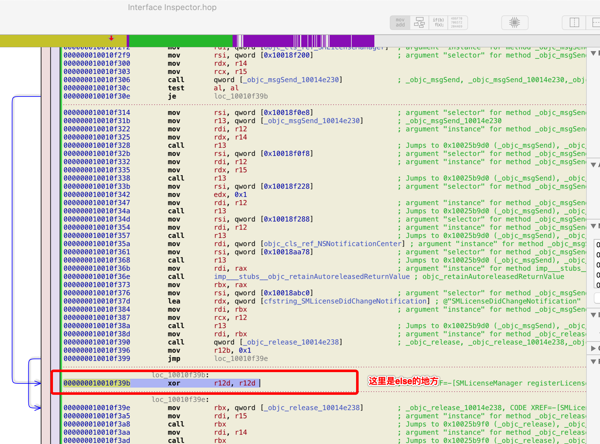
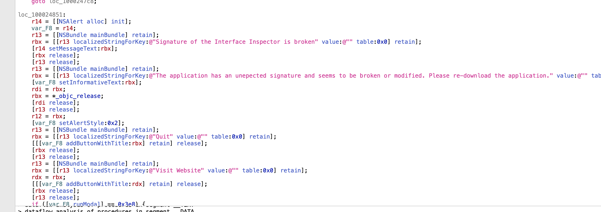
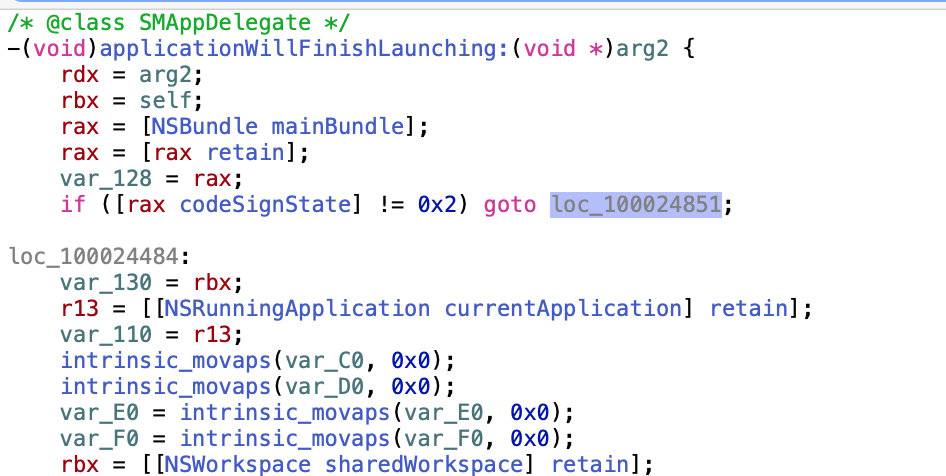

#  Interface Inspector 破解之路
## 准备
* 首先肯定要[下载软件](https://www.interface-inspector.com/),安装到Mac上。
* [Hopper](https://www.hopperapp.com/) 神器安装上
## 开干
先打开Interface-inspector 看一下


Hopper打开Interface Inspector的可执行文件


左侧tab页搜索`register`关键字

从名字上看`SMEnterLicenseViewController register`像是注册的用到的，点开看一下，反正不要钱。

```
 rax = [r14 enterLicenseViewControllerDidSelectRegister:r15 withLicenseName:r12 code:rbx];
```
应该就这这里了进一步跟进去看一看

` rbx = [rax registerLicenseWithName:r12 code:rcx];` 通过这行代码接着跟


到这里基本算是跟到头了，`r12`变量就是干这个验证通过没有通过的活的。
改代码

`Modify -> Assemble Instruction`
else的地方直接改成赋值为1
```
000000010010f39b         mov        r12b, 0x1  
```
`File -> Produce New Executable`生成新的可执行文件，在弹框中选择移除签名


打开Interface Inspector

有签名校验，有意思，接着走
通过关键字符串`Signature of the Interface inspector is broken`继续找

点开按着X一层一层找引用


`loc_100024851`找下谁在用,就在当前文件里，goto了

`if ([rax codeSignState] != 0x2) goto loc_100024851;`
改一下goto

改代码
```
000000010002447e         jne        loc_100024851
```
改为
```
000000010002447e         jne        loc_100024484        
```
保存为新的可执行文件，依旧是移除签名，再次重新打开Interface inspector

熟悉的界面又回来了
`name`和`license`随便输入


破解成功


## 总结
参考了AloneMonkey的文章，但是到修改签名的那部分就有点跟不上了，改二进制，找terminate符号，之后自己按照自己的思路搞一波，发现比他的还要简单一点。

## 错误解决

attach process过程中出现‘error:can not comminute with a helper application’
解决方法：
clone：https://github.com/rentzsch/mach_inject
之后用Xcode build mach_inject_bundle 项目将 生成好的framework 替换`/Library/Frameworks`下的mach_inject_bundle.framework文件即可
## 参考
[一篇文章走进Mac逆向的世界 | AloneMonkey](http://www.alonemonkey.com/2017/05/31/get-start-with-mac-reverse/)
